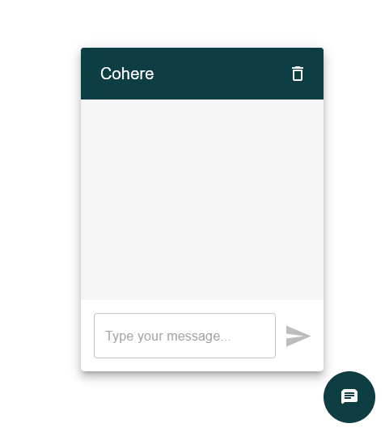

# Cohere Chatbot

A chatbot application built with ReactJS, Material-UI, styled-components, Zustand for state management, and integrates with an external chat API.

## Features

- Real-time chat interface
- Dynamic light/dark mode
- Context persisting conversation using `uuidv4` as `conversation_id`
- Integration with external chat [API](https://cohere.com/) for message handling using Express.js
- Persistent storage of chat history using `localStorage`

## Run Locally

#### Clone the project

```bash
git clone hhttps://github.com/melome/cohere-ai-chatbot.git
```

#### Go to the project directory and install dependecies
Start the client
```bash
cd cohere-ai-chatbot/client
npm install
npm npm run dev
```

Start the server
```bash
cd cohere-ai-chatbot/server
npm install
npm start
```

#### Environment Variables

To run this project, you will need to add the following environment variables to your `.env` file:

- `COHERE_API_KEY`: Your API key for accessing the chat API

## API Reference

### Send Chat Message

```http
POST /api/chat/:conversation_id?
```

| Parameter  | Type     | Description               |
| :--------- | :------- | :------------------------ |
| `message`  | `string` | **Required**. User message |

## Screenshots



## License

This project is licensed under the [MIT License](https://choosealicense.com/licenses/mit/).